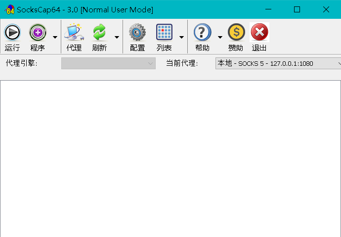
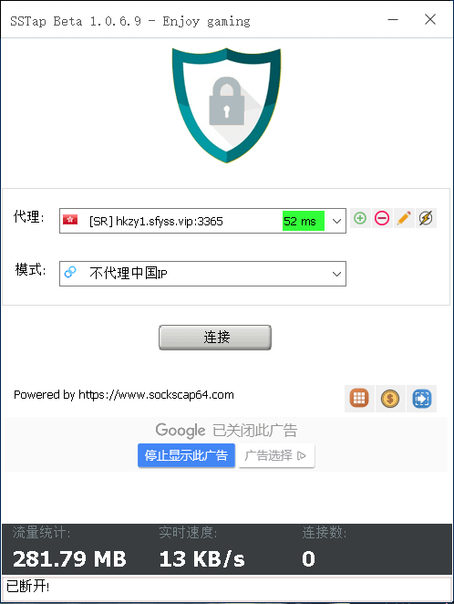

> 现在市面上常见的方法：google 就是使用 vpn，外服游戏就使用国际路线加速器，而稍微再喜欢折腾的朋友就会知道还有 ss、ssr（简单理解为 ss 加强版）。ss 相对于 vpn 来说更加便宜，但是网速真的是不差。对于喜欢玩外服网游的朋友们，特别的是 coding man 这种即需要 google 又需要玩外服的朋友往往需要同时拥有 vpn 和加速器，就算你付年费，两者加起来一年也要四五百吧。所以我介绍的方法就是 ss 配合免费工具玩外服游戏，同时 ss 又可以进行 google。

<!-- more -->

## SocksCap64

后来发现看到网上有人说 ss 配合 SocksCap64（见下图）可以对特定程序进行加速，从而对某个游戏进行加速，我没有测试成功，有可能是因为 ss 的线路不对，现在看来，用 ss 玩游戏还是用香港的线路比较好。

## SSTap

最近发现 SocksCap64 的开发者开发了专门针对外服游戏的工具 SSTap（见下图），并且不用配合 ss 可以独立工作。进行相关配置（切记使用香港路线）以后就可以直接 google 和外服。据我得知，ss 一般年费也就 150 左右，当然还有更便宜的和更贵的，你可以根据需要进行选择，当然你如果喜欢捣鼓和追求质量，可以自己搭建 ss。

## 总结

据我得知，ss 一般年费也就 150 左右，当然还有更便宜的和更贵的，你可以根据需要进行选择，当然你如果喜欢捣鼓和追求质量，可以自己搭建 ss，简单至极。上面两个工具和搭建 ss，以及 ss 工具的相关教程自行百度。

## 彩蛋

SocksCap64 和 SSTap 的网址：https://www.sockscap64.com ，如果你说找不到 SSTap，就说明你不认真呀小伙子！还有，切记尽量使用香港线路玩游戏！

个人博客：[**汪荣顶**](www.fedtop.com)
